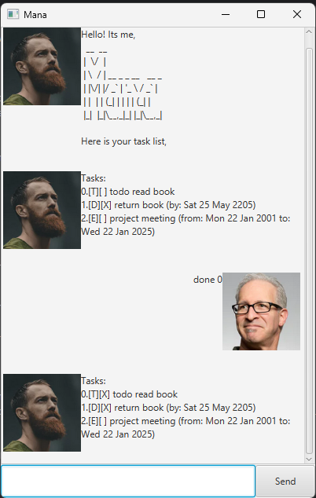
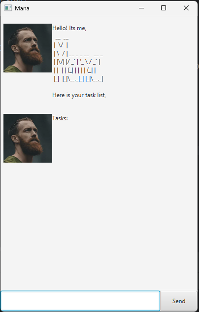

# Mana User Guide

Mana is a **desktop app for managing tasks, optimized for use via a Command Line Interface** (CLI),
while still having the benefits of a Graphical User Interface (GUI). Its
- text-based
- easy to learn 
- ~~FAST~~ SUPER FAST to use

* Table of Contents 
=================
* [Quick Start](#quick-start)
* [Features](#features)
  * [Adding tasks](#adding-tasks)
  * [Deleting tasks `delete`](#deleting-tasks-delete)
  * [Listing tasks `list`](#listing-tasks-list)
  * [Finding tasks `find`](#finding-tasks-find)
  * [Marking tasks `done/undone`](#marking-tasks-as-doneundone-doneundone)
  * [Saving and Loading](#saving--loading)
  * [Loading external files: `load`](#loading-from-other-files-load)
  * [Exiting the program `exit`](#exiting-exit)
* [FAQ](#faq)
  

------------------------------------------------------------------------------------------------------------------

## Quick start

1. Ensure you have Java `17` or above installed in your Computer.
1. Download the latest `.jar` file from [here](https://github.com/wallacepck/ip/releases)
1. Copy the file to the folder you want to use as the _home folder_ for your AddressBook.
2. Open a command terminal, `cd` into the folder you put the jar file in, and use `java -jar mana.jar` command to run the application. 
   A GUI similar to below should appear in a few seconds. Note that there is no data before you use it. 
    
3. Type the command in the command box and press Enter to execute it. Refer to [Features](#features) for a list of the available actions and commands

------------------------------------------------------------------------------------------------------------------

## Features

>**Notes about the command format:** 
> 
>* Words in `UPPER_CASE` are the parameters to be supplied by the user. 
e.g. in `find TEXT`, `TEXT` is a parameter which can be used as `find homework`.
>
>* Parameters can be in any order. 
 e.g. if the command specifies `--from START_DATE --to END_DATE`, `--to END_DATE --from START_DATE` is also acceptable.
>
>* Extraneous parameters for commands that do not take in parameters (such as `list`, `exit`) will throw an error.
  e.g. if the command `list 123` is given, the program will throw an error.

### Adding tasks:
Adds a task to the tasklist, the tasks can be a `todo`, `deadline`, or`event`

Format: 
  `todo TITLE` 
  `deadline TITLE --by DATE` 
  `event TITLE --from START_DATE --to END_DATE` 

Date format is strictly `dd-MM-yyyy` 

Examples: 
* Create a todo to do homework: 
  `todo do homework`
* Create a deadline to return a book: 
  `deadline return book --by 21-02-2025`
* Create an event for project work: 
  `event project work --from 21-02-2025 --to 25-02-2025`

### Deleting tasks: `delete`
Delete a task from the list

Format: `delete INDEX` 
* whereby `INDEX` is the task's index on the list.  

### Listing tasks: `list`
List all tasks on the list

Format: `list`

### Finding tasks: `find`
Finds tasks whose title contains the given text

Format: `find TEXT`

Examples:
* Find tasks with "book" in title: 
`find book`
* Find tasks with "cheese toast" in title: 
`find cheese toast`

### Marking tasks as Done/Undone: `done/undone`
Mark a task as done/undone

Format: 
`done INDEX` 
`undone INDEX` 
* whereby `INDEX` is the task's index on the list.

### Saving & Loading
Saving and loading is done automatically to a file located at `.\data\tasks.json`. 
There is no input required from the user.  
You may edit this file manually - however, Mana will throw an error on startup if it fails to read your file due to wrong formatting.

### Loading from other files: `load`
Load the tasklist from a previously saved file located in the `.\data` directory.

Format:`load FILENAME`  

:bulb: **Tip:**
Loading files from other directories is currently not supported

* `FILENAME` includes the `.json` extension.

Example:   
`load test.json`

### Exiting: `exit`
Exit the program. Program will gracefully shut down shortly after using the command.

Format: `exit`
* User input will not be accepted after using the `exit` command.

------------------------------------------------------------------------------------------------------------------

## FAQ

**Q**: How do I transfer my tasks to another Computer/User?  
**A**: Install the app in the other location and overwrite the data file it creates with the file that contains the data for your previous Mana tasks. See [Saving and loading](#saving--loading)